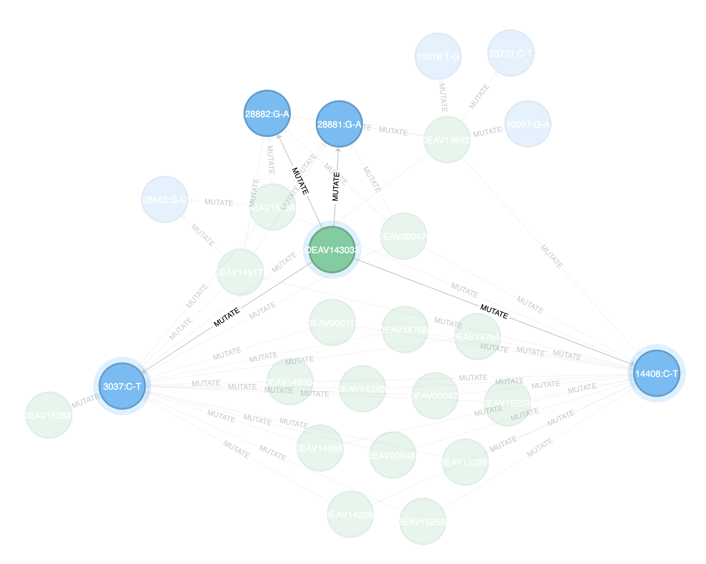

# Blooom

  

Graph visualization for human! 

Visualize [Neo4j](https://neo4j.com/) [API response](https://neo4j.com/docs/http-api/current/introduction) and other graph data.



## Features

- **Informative**: directed, labelled relationships, customizable node label
- **Interactive**: zoom, drag, focus on hover, and even fix on right click.
- **Responsive**: auto-resize on window resizing.

## Example

### Use `Blooom` as a nodejs package

```html
<div id="canvas"></div>

<script>
  import Blooom from "blooom";
  import 'blooom/dist/main.min.css'

  new Blooom("#canvas", neoData, {
    nodeLabelProperties: {
      mutation: "position",
      Molecular_Individual: "virus_id",
    },
  });
</script>
```

### Use `Blooom` as a ES6 module

See `example/browser.html` for a simple demo.

```html
<link rel="stylesheet" href="blooom/dist/main.min.css" />
<script src="https://cdn.jsdelivr.net/npm/d3@5.16.0"></script>
<script src="blooom/dist/main.es.browser.min.js"></script>

<div id="canvas"></div>

<script>
  new Blooom("#canvas", neoData, {
    nodeLabelProperties: {
      mutation: "position",
      Molecular_Individual: "virus_id",
    },
  });
</script>
```

## Dev preparation

```bash
gulp
```

## Credit

- [neo4jd3.js](https://github.com/eisman/neo4jd3)

## Repository

**Github:** [John-Theo/blooom.js](https://github.com/John-Theo/blooom.js)

## License

This application comes with **ABSOLUTELY NO WARRANTY**, to the extent permitted by applicable law.
